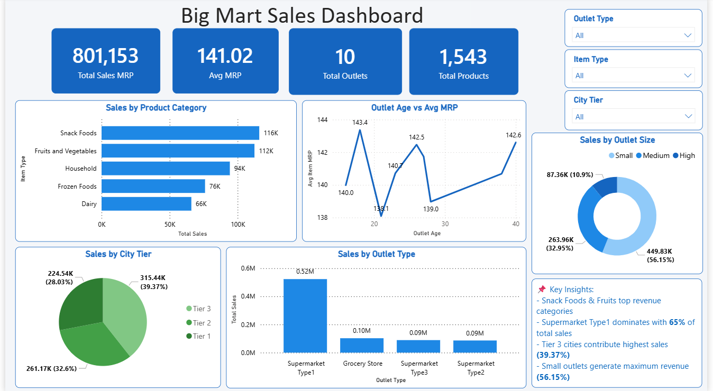

# 🏪 BigMart Retail Sales Dashboard

A full end-to-end **Business Analytics** project that analyzes BigMart retail sales data to uncover meaningful insights about product performance, outlet efficiency, and regional sales trends — presented through an interactive Power BI dashboard.

---

## 📌 Table of Contents

- [Project Overview](#project-overview)
- [Tech Stack](#tech-stack)
- [Dataset Description](#dataset-description)
- [Project Architecture](#project-architecture)
- [Setup & Installation](#setup--installation)
- [Project Levels](#project-levels)
- [Dashboard Preview](#dashboard-preview)
- [Key Insights](#key-insights)
- [Folder Structure](#folder-structure)
- [Future Improvements](#future-improvements)

---

## Project Overview

This project analyzes **5,681 retail transaction records** from BigMart stores to explore:

- Which product categories generate the most revenue?
- How do different outlet types and sizes perform?
- What is the impact of city tier on sales?
- How does outlet age relate to average pricing?

The output is a **single-page interactive Power BI dashboard** covering all key business dimensions with slicers, KPI cards, and actionable insights.

---

## Tech Stack

| Layer | Tools Used |
|---|---|
| Data Cleaning & EDA | Python, Pandas, Jupyter Notebook |
| Visualization (EDA) | Matplotlib, Seaborn |
| Dashboard | Power BI Desktop |
| Data Format | CSV → Python → Power BI |

---

## Dataset Description

### `Big_Mart_Sales.csv` — Retail Sales Data

| Column | Description |
|---|---|
| `Item_Identifier` | Unique product ID |
| `Item_Weight` | Weight of the product |
| `Item_Fat_Content` | Fat content — Low Fat / Regular |
| `Item_Visibility` | % of display area allocated in store |
| `Item_Type` | Product category (16 types) |
| `Item_MRP` | Maximum Retail Price (used as sales proxy) |
| `Outlet_Identifier` | Unique store ID |
| `Outlet_Establishment_Year` | Year the outlet was established |
| `Outlet_Size` | Store size — Small / Medium / High |
| `Outlet_Location_Type` | City tier — Tier 1 / 2 / 3 |
| `Outlet_Type` | Store type — Grocery Store / Supermarket |

> **Note:** `Item_MRP` is used as the sales proxy since actual sales figures are not available in this dataset.

---

## Project Architecture

```
Raw CSV (Big_Mart_Sales.csv)
        │
        ▼
Python / Jupyter Notebook
  ├── Level 1 — Data Understanding
  │     └── Structure review, missing values, inconsistencies, stats
  ├── Level 2 — Data Preparation
  │     └── Cleaning, standardization, feature engineering
  ├── Level 3 — Sales Analysis
  │     └── KPIs, category analysis, outlet analysis, top products
  └── Level 4 — Data Visualization
        └── Charts — bar, pie, line, scatter
        │
        ▼
Cleaned CSV (Big_Mart_Sales_Cleaned.csv)
        │
        ▼
Power BI Dashboard
  └── 1 Page | 7 Visuals | 3 Slicers | KPI Cards | Key Insights
```

---

## Setup & Installation

### Prerequisites

- Jupyter Notebook / Anaconda
- Power BI Desktop (Windows)

### 1. Clone the Repository

```bash
git clone https://github.com/vikrantsonawane24/BigMart-Sales-Dashboard-Excel-Python-PowerBI.git
cd BigMart-Sales-Dashboard-Excel-Python-PowerBI
```

### 2. Install Python Dependencies

```bash
pip install -r requirements.txt
```

**`requirements.txt`:**
```
pandas
numpy
matplotlib
seaborn
jupyter
```

### 3. Run Jupyter Notebooks

```bash
jupyter notebook
```

Run notebooks in order:
1. ` Data_Understanding_BM_sales L1.ipynb`
2. ` Data_Prepration_BM_sales L2.ipynb`
3. ` Sales_Analysis_BM_sales L3.ipynb`

### 4. Open Power BI Dashboard

1. Open Power BI Desktop
2. Open `BigMart_Sales_Dashboard.pbix`
3. If data source error → Transform Data → update CSV path
4. Refresh

---

## Project Levels

### Level 1 — Data Understanding
- Loaded dataset: **5,681 rows × 11 columns**
- Identified missing values — `Item_Weight` (976 rows = 17.2%), `Outlet_Size` (1,606 rows = 28.3%)
- Found inconsistencies in `Item_Fat_Content` — 'LF', 'low fat', 'reg' labels
- Generated descriptive statistics and visualized missing values

### Level 2 — Data Preparation
- Standardized `Item_Fat_Content` → **Low Fat / Regular**
- Filled `Item_Weight` missing values with **median per Item_Type**
- Filled `Outlet_Size` missing values with **mode per Outlet_Type**
- Feature engineered `Outlet_Age = 2025 - Outlet_Establishment_Year`
- Exported clean dataset → `Big_Mart_Sales_Cleaned.csv`

### Level 3 — Sales Analysis
- Calculated overall KPIs — Total Sales, Avg MRP, Total Outlets, Total Products
- Analyzed sales by **Product Category**, **Outlet Type**, **Outlet Size**, **City Tier**
- Identified **Top 5 performing product categories** by revenue

### Level 4 — Data Visualization
- Horizontal bar chart — Sales by Category
- Vertical bar chart — Sales by Outlet Type
- Pie charts — Outlet Size & City Tier distribution
- Line chart — Outlet Age vs Avg MRP trend
- KPI summary cards

### Level 5 — Power BI Dashboard
- **4 KPI Cards** — Total Sales, Avg MRP, Total Outlets, Total Products
- **3 Slicers** — Outlet Type, Item Type, City Tier
- **5 Visuals** — Bar, Column, Donut, Pie, Line charts
- **Key Business Insights** panel with actionable findings

---

## Dashboard Preview



---

## Key Insights

- 🥇 **Snack Foods & Fruits and Vegetables** are the top revenue-generating categories
- 🏪 **Supermarket Type1** dominates with **65% of total sales** (₹5,20,000+)
- 📍 **Tier 3 cities** contribute the highest sales share at **39.37%**
- 📏 **Small outlets** generate maximum revenue at **56.15%**
- 💰 **Total Sales (MRP): ₹8,01,153** across **10 outlets** and **1,543 products**
- 📅 **Older outlets** maintain stable average MRP — consistent brand performance over time

---

## Folder Structure

```
BigMart-Sales-Dashboard-Excel-Python-PowerBI/
│
├── Data/
│   ├── Big_Mart_Sales.csv                  # Raw dataset
│   └── Big_Mart_Sales_Cleaned.csv          # Cleaned dataset
│
├── Notebooks/
│   ├── Level1_Data_Understanding.ipynb
│   ├── Level2_Data_Preparation.ipynb
│   ├── Level3_Sales_Analysis.ipynb
│   └── Level4_Data_Visualization.ipynb
│
├── Charts/
│   ├── dashboard.png
│   ├── sales_by_category.png
│   ├── sales_by_outlet.png
│   ├── pie_charts.png
│   └── outlet_age_trend.png
│
├── PowerBI/
│   └── BigMart_Sales_Dashboard.pbix
│
├── requirements.txt
└── README.md
```

---

## Future Improvements

- Add **Streamlit web app** for interactive exploration without Power BI
- Integrate **actual sales figures** for more accurate revenue analysis
- Build a **product recommendation engine** based on category + MRP similarity
- Add **store-level profitability analysis** using outlet age and size
- Automate data pipeline using **Apache Airflow**

---

## 👤 Author

**Vikrant Sonawane**
- 📍 Kalyan, Maharashtra, India
- 📧 vikrantsonawane24@gmail.com
- 🔗 [linkedin.com/in/vikrantsonawane24](https://linkedin.com/in/vikrantsonawane24)

---
- This project was built as part of the Sysslan IT Solutions Business Analytics Internship — covering the complete analytics pipeline from raw data to business-ready dashboard.
